<!-- terminal portrait + neofetch card
     portrait: python scripts/prep_photo.py photo.png && python scripts/make_ascii_svg.py
     card:     python scripts/make_info_card.py -->

<h3><code>oscar@github ~ $ whoami</code></h3>

<table>
<tr>
<td valign="top"></td>
<td valign="top"></td>
</tr>
</table>

 
 

<!-- contribution graph: real data, boxes reveal cell by cell
     regenerated daily by .github/workflows/update-profile-art.yml -->

<h3><code>oscar@github ~ $ ./contributions.sh</code></h3>

 
 

<h3><code>oscar@github ~ $ ./links.sh</code></h3>

<b>Cloud &amp; AI/ML Engineer · Agentic Workflows · RAG · MCP</b>

 

<h3><code>oscar@github ~ $ ls ~/projects</code></h3>

| Project | What it demonstrates |
|---------|----------------------|
| [raditriage](https://github.com/ovalles2019/raditriage) · [live](https://raditriage.onrender.com/) | Agentic vet radiology — classify→RAG→draft→route, RBAC, Claude proxy |
| [cloud-sre-agent](https://github.com/ovalles2019/cloud-sre-agent) · [live](https://cloud-sre-agent.onrender.com/) | Bedrock SRE/FinOps agent — CloudWatch, Cost Explorer, HITL |
| [agentic-governance-harness](https://github.com/ovalles2019/agentic-governance-harness) · [live](https://agentic-governance-demo.onrender.com/) | Agentic AI governance benchmark |
| [agentic-ai-workflows](https://github.com/ovalles2019/agentic-ai-workflows) | LangChain · LangGraph · CrewAI · AutoGen |
| [pgvector-rag-demo](https://github.com/ovalles2019/pgvector-rag-demo) | PostgreSQL + pgvector RAG |
| [aws-cloudops-mcp](https://github.com/ovalles2019/aws-cloudops-mcp) | AWS CloudOps MCP server |

