## <code>oscar@github ~ $ ./contributions.sh</code>

<<<<<<< HEAD
- Portfolio site: [oscar-valles.com](https://www.oscar-valles.com/)
- Blog: [Medium @ovalles6845](https://medium.com/@ovalles6845)
- M.S. Computer Engineering (cloud & AI focus), @ University of Texas at Dallas
=======

>>>>>>> 29423de (feat: animated profile with ASCII portrait and live heatmap)

---

## <code>oscar@github ~ $ whoami</code>

<table>
  <tr>
    <td valign="top" width="50%">
      

      
    </td>
    <td valign="top" width="50%">
      

      
    </td>
  </tr>
</table>

---

## Featured Projects

| Project | What it demonstrates |
|---------|----------------------|
| [raditriage](https://github.com/ovalles2019/raditriage) · [live demo](https://raditriage.onrender.com/) | **Agentic** veterinary radiology workflow — classify→RAG→draft→route, **RBAC**, SLA dashboard, Claude proxy |
| [cloud-sre-agent](https://github.com/ovalles2019/cloud-sre-agent) · [live demo](https://cloud-sre-agent.onrender.com/) | **Bedrock** SRE/FinOps agent — CloudWatch, Cost Explorer, Trusted Advisor, HITL remediation |
| [agentic-governance-harness](https://github.com/ovalles2019/agentic-governance-harness) · [live demo](https://agentic-governance-demo.onrender.com/) | Agentic AI **governance benchmark** — guardrail trip rate, policy latency, cost metrics |
| [agentic-ai-workflows](https://github.com/ovalles2019/agentic-ai-workflows) | Single & multi-agent patterns with **LangChain**, **LangGraph**, **CrewAI**, **AutoGen** |
| [pgvector-rag-demo](https://github.com/ovalles2019/pgvector-rag-demo) | RAG with **PostgreSQL + pgvector**, local embeddings, Streamlit UI |
| [aws-cloudops-mcp](https://github.com/ovalles2019/aws-cloudops-mcp) | AWS CloudOps MCP server (EC2, CloudWatch, S3, Lambda, …) |

## Tech Stack

## Get in Touch

- **Portfolio:** [oscar-valles.com](https://oscar-valles.com)
- **LinkedIn:** [oscarvalles87](https://www.linkedin.com/in/oscarvalles87/)
- **Email:** oscar.valles@utdallas.edu

